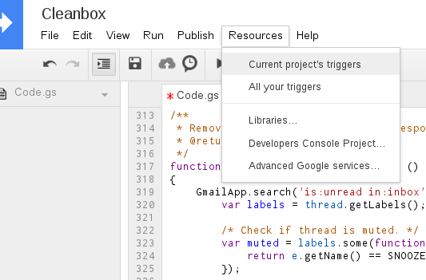
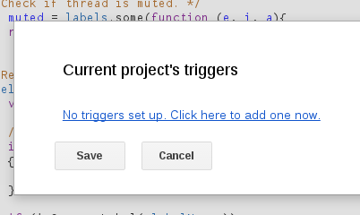

# Cleanbox Installation

1. Go to your Google Drive and create a new Google Apps Script.
   
2. A new tab will be open. When asked for, click *Blank Project*.
   
3. Copy the content of [script.js](script.js) and paste into the typing area.
You should replace any default code that was created with the new project --
not quite blank after all, huh? ;-)
4. Rename the *unnamed project* to *Cleanbox* (if you wish).
5. On the top bar menu, click *Resources* and then *Current project's triggers*.
   
6. Click to add a new trigger.
   
7. Set up necessary triggers as previously explained on the [README](README.md).
   
